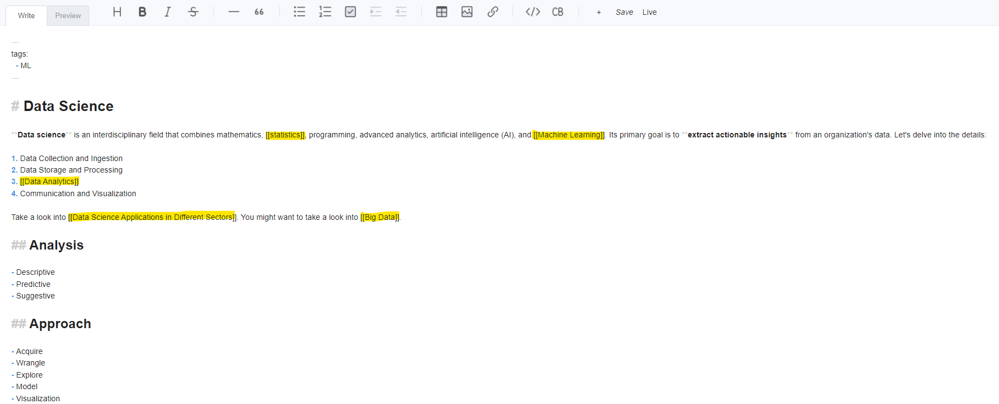
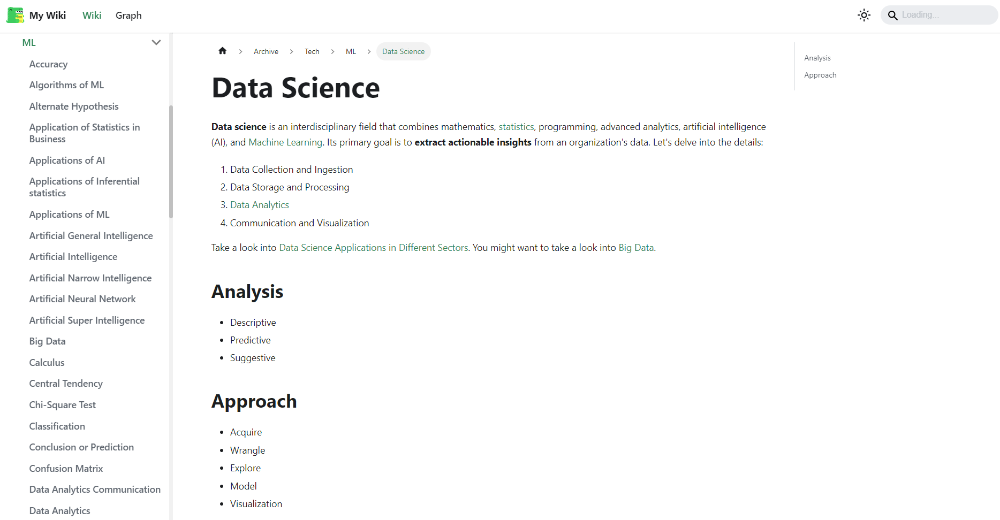
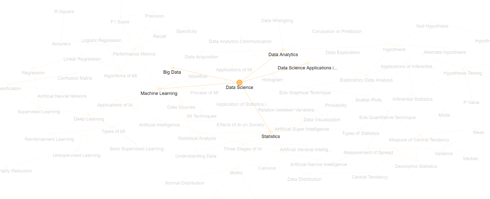
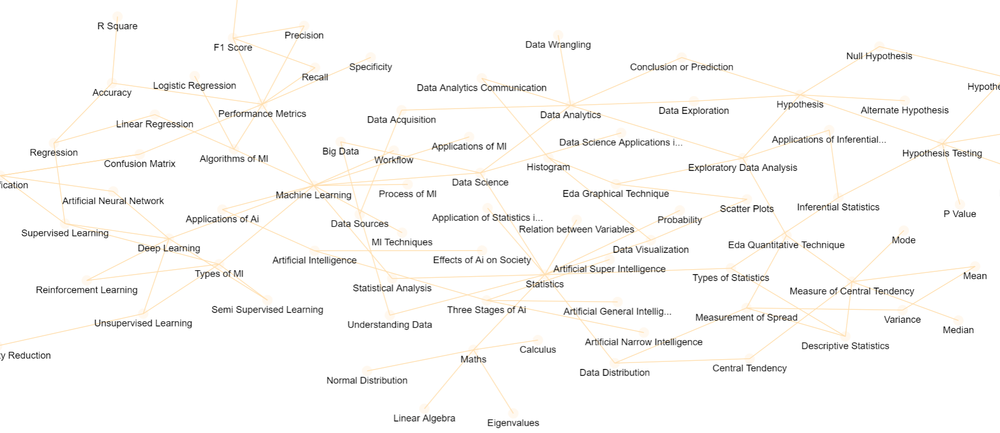

# Zettel Wiki

Zettel Wiki uses [Docusaurus](https://docusaurus.io/), to generate static website.

Write in markdown and link documents with `[[wiki links]]`. Visualize the links in the form of a graph.

## Markdown Editor



## Generated Website



## Graph





## Setup

### Installation

```bash
yarn
cd editor 
yarn
cd upload-service
yarn
```

### Local Development

```bash
yarn start
```

This command starts a local development server and opens up a browser window. Most changes are reflected live without having to restart the server.

### Local Development with Editor

```bash
yarn startall
```

This command starts a local development server with editor support upon clicking "Edit this page".

### Build

```bash
yarn build
```

This command generates static content into the `build` directory and can be served using any static contents hosting service.

### Serve Locally

```bash
yarn serve
```

This command serves the static contents generated by `yarn build` command.

## Documentation

All md and mdx files in docs will be generated as static html content and presented in browser.

A document can refer another document by wiki links mentioned in the format of `[[Referenced File Name]]`. This wiki link will be converted into a link refering `Referenced File Name.md`.

## Graph

Based on the links between documents, a graph is generated.
